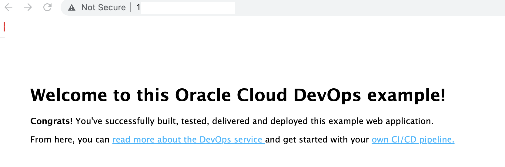

# pulumi-python-oci-devops-oke

[](https://img.shields.io/badge/license-UPL-green) [](https://sonarcloud.io/dashboard?id=oracle-devrel_pulumi-python-oci-devops-oke)


## Introduction
It is an integration of **OCI Pulumi** and **OCI DevOps**. The reference code base will deploy an application over OCI OKE using OCI DevOps, with Pulumi as an infra as a code tool.


Rapid delivery of software is essential for efficiently running your applications in the cloud. Oracle Cloud Infrastructure (OCI) DevOps services provide a continuous integration and deployment (CI/CD) platform for developers to easily build, test, and deploy software and applications on Oracle Cloud.

This reference architecture builds and tests a sample Node.js web application and then deploys it to OKE by using the OCI DevOps. The application source code is hosted on a DevOps code repository. The end-user commits the code into the code repository, which triggers the start of a build pipeline.

The build pipeline follows a user-defined flow to build and test software, then create a container image of the latest version of the application. The output of the build is stored in the container registry as an image. Then a deployment pipeline uses the built image from the container registry and a Kubernetes manifest to deploy the most recent version of the application to OKE.


For details of the architecture, see [Build a continuous integration and deployment pipeline using Oracle DevOps service](https://docs.oracle.com/en/solutions/ci-cd-pipe-oci-devops/index.html)

## Prerequisites
1. Download and install Pulumi CLI - https://www.pulumi.com/docs/get-started/install/
2. If not installed, download and install Python3 (3.7 or later) - https://www.python.org/downloads/
3. Oracle credentilas for Pulumi - https://www.pulumi.com/registry/packages/oci/installation-configuration/

## Optional Prerequisites

- You can manage pulumi stack with stage-managed by pulumi itself, to do so create an account on Pulumi via - https://app.pulumi.com/
- In the below procedure we will be explaining steps where the state is managed by Pulumi or with a local file.

## How to deploy

- Validate the execution of Pulumi CLI - `pulumi version`
- Validate the python3 execution - `python -V`
- Create a folder for the code and switch into it.
```markdown
$ mkdir oci-pulumi-devops
$ cd oci-pulumi-devops
```

- Login to pulumi
  - If you wish to have the infra states managed by Pulumi use `pulumi login` and follow the instruction.
  - You can create a personal access token via the URL and copy it back to the pulumi login prompt as well.


- If you wish to manage the states locally follow below
```markdown

$ mkdir pulumi-state-local
$ pulumi login file://pulumi-state-local
```


- Create a new pulumi stack - `pulumi new https://github.com/oracle-devrel/pulumi-python-oci-devops-oke ` --force
- Do not need to use `--force ` for login with Pulumi managed infra state mode.
- Provide a project and stack name as  `pulumi-python-oci-devops-oke`.
- You may enter or keep an empty passphrase when asked for the config(This is for locally managed pulumi state).
- The above step will install all the relevant requirements and set you ready to proceed.


- Let's preview the stack using below
```markdown
$ touch .random.txt
$ pulumi preview 
```
- It will list all the components to create but with debugging errors, as expected.
-


- Debug errors are due to the fact the OCI credentials are not yet set up.
- Set below   the environment variables Or with Secret configs - https://www.pulumi.com/registry/packages/oci/installation-configuration/

- As ENV values.

```markdown
export TF_VAR_tenancy_ocid="ocid1.tenancy.ocx..<unique_ID>"
export TF_VAR_user_ocid="ocid1.user.ocx..<unique_ID>"
export TF_VAR_fingerprint="<key_fingerprint>"
export TF_VAR_region="OCI Region"
export TF_VAR_private_key_file="/path/to/oci_api_key.pem"

export TF_VAR_oci_user="username"

# For a federated user (single sign-on with an identity provider), enter the username in the following format: TenancyName/Federation/UserName.
# For example, if you use OCI's identity provider, your login would be, Acme/oracleidentitycloudservice/alice.jones@acme.com.
#If you are using OCI's direct sign-in, enter the username in the following format: TenancyName/YourUserName. For example, Acme/alice_jones. Your password is the auth token you created previously.

export TF_VAR_oci_user_password="****"

# You can get the auth token from your Profile menu -> click User Settings -> On the left side  click *Auth Tokens -> Generate Token
```

- Set OCI Pulumi config values (Except three all other configurations are set to default).

```markdown
$ pulumi config set compartment_ocid <OCID of your compartment>
$ pulumi config set app_name_prefix <A prefix for your resource's name /default is pulumi_devops>
$ pulumi config set autobuild_run "False" - To disable auto-build run /default is "True"
```
- You may verify the configuration of your stack using file [Pulumi.oci-devops-oke.yaml.](pulumi-python-oci-devops-oke. yaml)
- Run a preview and validate the configuration and stack.

```markdown
$ touch .random.txt
$ pulumi preview 
```


- Create the stack using `pulumi up`


- It may take 20 to 30 minutes to complete the tasks along with the first build run if it's enabled.


## Validate the application deployment.

- using `OCI Console` > `Developer Services` > `DevOps` > `Project` > `oci_pulumi_devops_project_xxx`
- Validate the `Build History` and `Deployments` and ensure that they succeeded.
- Access the OKE Cluster - `OCI Console` > `Developer Services` > `Kubernetes Clusters(OKE)`
- Using `Access Cluster` set your access to the Kubernetes, or You may use kubectl with the Kube-config under the folder `generated/kubeconfig`
- Get the external IP address and launch the application using a browser - `http://externalIP`.
```markdown
kubectl get svc -n ns-node
```


## Destroy the stack.

- Delete the application load balancer (via OCI Console ) or clean the Kubernetes services (Using kubectl) before destroying the stack.

```markdown
$ kubectl delete svc node-gettingstarted-service -n ns-node
```

- Do a `pulumi destroy` and delete the components.


- The operation would take 20 to 30 minutes to complete.
- Delete the stack using `pulumi stack rm pulumi-python-oci-devops-oke`
- Log out from pulumi - `pulumi logout`

## Read more

- Pulumi and OCI - https://www.pulumi.com/registry/packages/oci/installation-configuration/
- Deploy the stack with Terraform and OCI resource manager - https://github.com/oracle-devrel/terraform-oci-arch-ci-cd-devops

## Contributors

Author: Rahul M R.
Collaborators: NA
Last release: May 2022

## Contributing
This project is open source.  Please submit your contributions by forking this repository and submitting a pull request!  Oracle appreciates any contributions that are made by the open-source community.

## License
Copyright (c) 2024 Oracle and/or its affiliates.

Licensed under the Universal Permissive License (UPL), Version 1.0.

See [LICENSE](LICENSE) for more details.

ORACLE AND ITS AFFILIATES DO NOT PROVIDE ANY WARRANTY WHATSOEVER, EXPRESS OR IMPLIED, FOR ANY SOFTWARE, MATERIAL OR CONTENT OF ANY KIND CONTAINED OR PRODUCED WITHIN THIS REPOSITORY, AND IN PARTICULAR SPECIFICALLY DISCLAIM ANY AND ALL IMPLIED WARRANTIES OF TITLE, NON-INFRINGEMENT, MERCHANTABILITY, AND FITNESS FOR A PARTICULAR PURPOSE.  FURTHERMORE, ORACLE AND ITS AFFILIATES DO NOT REPRESENT THAT ANY CUSTOMARY SECURITY REVIEW HAS BEEN PERFORMED WITH RESPECT TO ANY SOFTWARE, MATERIAL OR CONTENT CONTAINED OR PRODUCED WITHIN THIS REPOSITORY. IN ADDITION, AND WITHOUT LIMITING THE FOREGOING, THIRD PARTIES MAY HAVE POSTED SOFTWARE, MATERIAL OR CONTENT TO THIS REPOSITORY WITHOUT ANY REVIEW. USE AT YOUR OWN RISK. 

